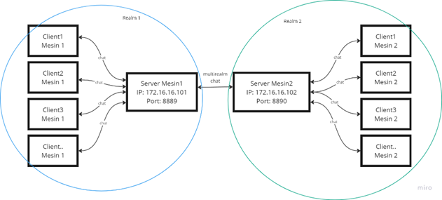

# chat-multirealm-python
Tugas 6 Pemrograman Jaringan Kelas C

| Nama | NRP |
| ------------- | ------------- |
| Duevano Fairuz Pandya | 5025211052 |

Instruksi Tugas 6 [disini](https://docs.google.com/presentation/d/1uT4mdCq7OhU4BgtcUAmZXVKwQ6e6PFpgwaU5hSMxEGE/edit#slide=id.g20a364d6b9e_0_29)

### Arsitektur Chat


### Cara Menjalankan Pengetesan

1. Gunakan jupyter/lab/mesin yang dibuat dari docker [disini](https://github.com/rm77/progjar/tree/master/environment)
2. Buka `localhost:60001` (jupyter mesin1 sebagai realm1), clone repositori, masuk ke folder realm1 untuk menjalankan server dan client di realm1
3. Jalankan program server realm1 
```
python3 ChatServer.py
```
4. Buka terminal lagi untuk clientnya, kemudian jalankan clientnya:
```
python3 ChatClient.py
```
5. Begitu pula untuk realm2, buka `localhost:60002` (jupyter mesin2 sebagai realm2), clone repositori dan seterusnya (sama seperti langkah sebelumnya).
6. Untuk cara menjalankan command nya bisa dilihat di (protokol.txt)[https://github.com/duevanofairuz/chat-multirealm-python/blob/main/PROTOKOL.txt]